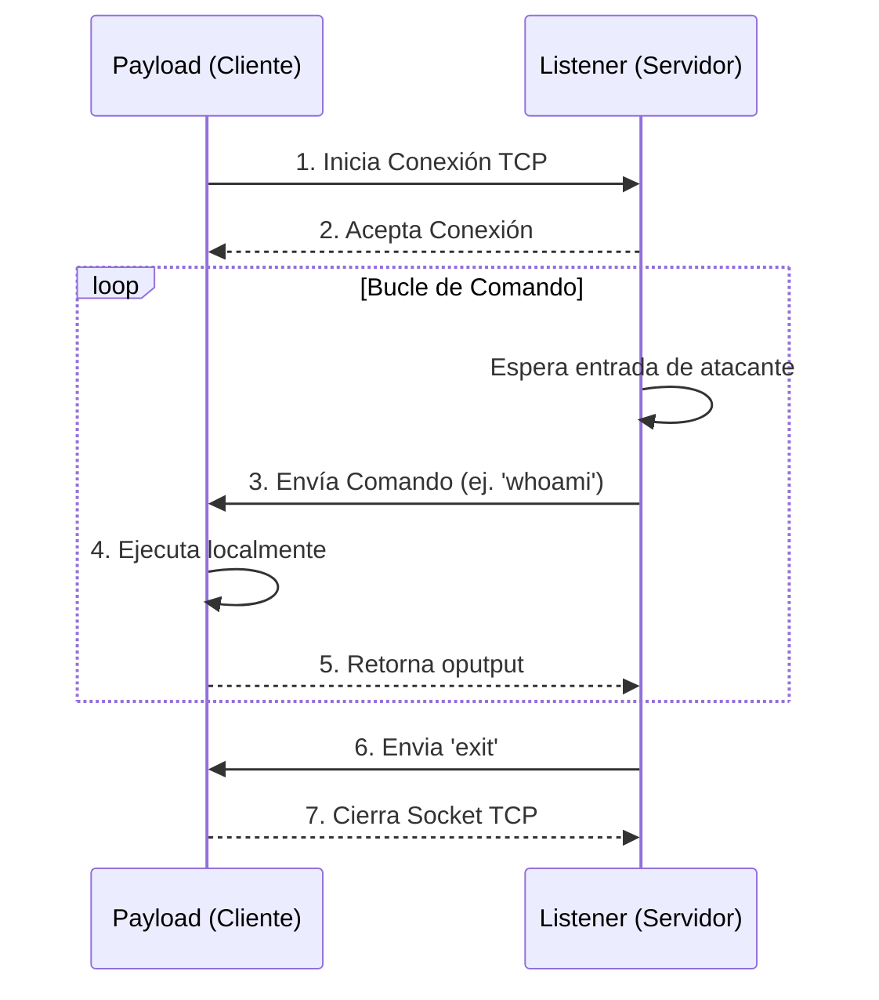

```mermaid
sequenceDiagram
    participant Bot as Payload (Cliente)
    participant C2 as Listener (Servidor)
    
    Bot->>C2: 1. Inicia Conexión TCP
    C2-->>Bot: 2. Acepta Conexión
    
    loop Bucle de Comando
        C2->>C2: Espera entrada de atacante
        C2->>Bot: 3. Envía Comando (ej. 'whoami')
        Bot->>Bot: 4. Ejecuta localmente
        Bot-->>C2: 5. Retorna oputput
    end
    
    C2->>Bot: 6. Envia 'exit'
    Bot-->>C2: 7. Cierra Socket TCP
```
